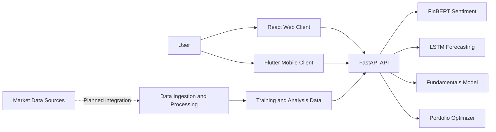

# System Architecture

## Overview

Smart Stock Trading Recommendation System is a client-server application for running stock analysis workflows. The current repository is organized into these boundaries:

- **Web client:** React and Material UI under `frontend/web`.
- **Mobile client:** Flutter under `frontend/mobile`.
- **API service:** FastAPI under `backend/api`.
- **ML layer:** Sentiment, technical forecasting, fundamentals, and portfolio modules under `ml`.
- **Data and scripts:** Raw, processed, and ingestion-related resources under `data` and `skills`.
- **Deployment:** Docker, CI/CD, and Kubernetes resources under `deployment`.

The API is the integration boundary. Clients should communicate with the backend through its HTTP contract and should not import model implementation code directly.

## Context Diagram

The first market-data provider is Yahoo Finance through `backend/services/market_data.py`. The API normalizes its chart response into timestamped OHLCV records. Sentiment, forecasting, and fundamentals inference are routed through configurable hosted Hugging Face models in `backend/services/huggingface.py`; the token remains server-side. FinBERT is verified for serverless text classification; numeric models require dedicated endpoint URLs and task-specific handlers. Database persistence and additional providers remain planned.

## Request Flow

1. A user enters analysis data in the web or mobile client.
2. The client sends an HTTP request to the FastAPI service.
3. FastAPI parses and validates request values using its type annotations.
4. The selected model or optimizer computes the result.
5. The API returns JSON to the client.
6. The client renders the result as a chart, table, or status view.

## API Layer

The API entry point is `backend/api/main.py`. It initializes the sentiment, forecasting, and fundamentals models when the application starts. The portfolio optimizer is created for each request from the supplied return and covariance data.

| Method | Endpoint | Request values | Response |
| --- | --- | --- | --- |
| `GET` | `/` | None | Service status message |
| `GET` | `/market-data/{symbol}` | `period`, `interval` query parameters | Normalized OHLCV history |
| `POST` | `/sentiment` | `text` string | Model sentiment result |
| `POST` | `/forecast` | Numeric `data` time series | `{ "forecast": [...] }` |
| `POST` | `/fundamentals` | Feature matrix `X`, targets `y` | `{ "prediction": [...] }` |
| `POST` | `/portfolio` | `returns`, `cov_matrix` | `{ "weights": [...] }` |
| `POST` | `/recommendation` | Fundamental, technical, and sentiment scores from `0` to `1` | Signal, confidence, score, and rationale |
| `POST` | `/recommendation/analyze` | Sentiment scores, prices, forecast, and fundamentals | Derived scores, indicators, signal, confidence, and rationale |

The recommendation response also includes a volatility-based risk score, transparent target and stop-loss levels, UTC freshness metadata, and the input evidence used for the calculation.

The Docker configuration runs the service with Uvicorn on port `8000`. FastAPI provides request parsing and validation through Python type annotations; explicit shared Pydantic request classes are not currently defined in the API module.

## Machine Learning Layer

The model responsibilities are separated by domain:

- `ml/sentiment/finbert_pipeline.py` performs financial text sentiment analysis.
- `ml/technicals/lstm_forecaster.py` forecasts values from a numeric time series.
- `ml/fundamentals/fundamentals_pipeline.py` trains and evaluates the fundamentals model.
- `ml/portfolio/portfolio_optimizer.py` computes portfolio allocations from returns and a covariance matrix.

The API coordinates these modules, while model-specific processing remains in the ML layer.

## Client Layer

The React application is located in `frontend/web`. Its dashboard routes are defined in `src/App.js`, with analysis views in `src/components`. Shared HTTP request functions live in `src/services/api.js`.

Web API configuration is selected by `src/config.js` using `REACT_APP_ENV` and the corresponding environment-specific API base URL. Local values are kept in `frontend/web/.env`; `.env.example` documents the expected variables without containing machine-specific secrets.

The Flutter application in `frontend/mobile` is a separate client and can use the same API boundary.

## Data and Persistence

The repository contains `data/raw` and `data/processed` areas plus ingestion and analysis scripts. These provide a place for source and prepared datasets, but the current FastAPI service does not connect to a database or persistent model registry.

SQLite for local development, PostgreSQL for staging or production, and external market-data providers such as Yahoo Finance or Alpha Vantage are suitable future integrations. They should be introduced behind repository or service interfaces rather than coupled directly to frontend components.

## Deployment

`deployment/docker/Dockerfile` builds a Python image, installs `requirements.txt`, copies the application into `/app`, and starts `backend.api.main:app` with Uvicorn. Kubernetes manifests and CI/CD configuration are maintained under `deployment/kubernetes` and `deployment/ci-cd`.

## Operational Considerations

Before production use, the system should add authentication, CORS policy, structured request schemas, input-size limits, model versioning, logging, health and readiness checks, monitoring, and a controlled persistence strategy. These are extension points rather than capabilities currently implemented by the repository.
